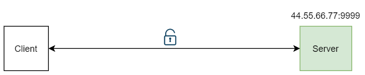
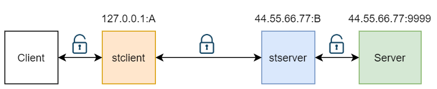

# gotun
tcp/udp转发器，可构建加密安全通道

## Feature
* 支持tcp,udp,quic,kcp流量转发
* 支持构建加密安全通道，可使用tcp,udp,quic,kcp作通道传输协议
* 支持内网穿透式安全通道
* web界面管理

## 使用
点此下载二进制文件，启动即可（会自动生成配置app.yaml）,最简配置:
```yaml
# web监听地址
web_listen: 0.0.0.0:8080
# web登录账号
web_username: admin
# web登录密码
web_password: admin
# 每小时登录失败限制次数
web_login_fail_limit_in_hour: 10
# 日志等级:debug/info/warn/error
log_level: info
# pprof监听地址,可为空
pprof_port: ""
```
访问[127.0.0.1:8080](http://127.0.0.1:8080),输入默认账号密码admin/admin登录<br>

## 内置服务
为了方便测试和部署，内置了一些服务，可通过配置文件启用(设置enable为true即可）
```yaml
# 内置服务配置
build-in:
    # 是否启用内置服务,总开关，false情况下不启用(会忽略下面的配置)
    enable: false
    # echo服务监听地址,用于测试，客户端向此端口发送什么就回什么，为空则不启动
    echo_listen: 0.0.0.0:8081
    # http代理服务监听地址,为空则不启动
    http_proxy_listen: 0.0.0.0:3128
    # socks5x服务配置,为空则不启动
    socks5x_server:
        listen_port: 1080
        udp_timeout: 120
        tcp_timeout: 120
```

## 安全通道服务
### 需求
假设远程主机有个服务Server，IP:44.55.66.77 监听端口9999，本地有Client与之非加密通信</br>
<br>
为了保证数据安全,远程主机部署gotun(stserver),监听端口B,客户端主机部署gotun(stclient),监听端口A<br>
stclient将流量加密，传输至44.55.66.77:B,stserver接收流量，进行解密，将流量传送至端口9999<br>
<br>
现在localhost:A已“伪装”成44.55.66.77:9999服务了，本地Client只需要和localhost:A通信即可<br>
走在外网的全是加密流量，此时远程主机也不用暴露9999端口，只需要开放端口B

### 创建
希望通过tcpMux作为加密通道，加密方式为gcm，加密key为goodweather<br>
需要创建一对服务，一个作为客户端，部署在本地：
```json
{
  "name": "stclient",
  "input": "tcp@0.0.0.0:A",
  "output": "tcp_mux@44.55.66.77:B",
  "mode": "",
  "in_proto_cfg": "{\"head\":\"\"}",
  "in_decrypt_mode": "",
  "in_decrypt_key": "",
  "in_extend": "",
  "out_proto_cfg": "{\"head\":\"\"}",
  "out_crypt_mode": "gcm",
  "out_crypt_key": "goodweather",
  "out_extend": "{\"mux_conn\":10}"
}
```
一个作为服务端，部署在44.55.66.77上：
```json
{
  "name": "stserver",
  "input": "tcp_mux@0.0.0.0:B",
  "output": "tcp@127.0.0.1:9999",
  "mode": "",
  "in_proto_cfg": "{\"head\":\"\"}",
  "in_decrypt_mode": "",
  "in_decrypt_key": "",
  "in_extend": "",
  "out_proto_cfg": "{\"head\":\"\"}",
  "out_crypt_mode": "gcm",
  "out_crypt_key": "goodweather",
  "out_extend": ""
}
```
要点：
* 客户端的output需要指向服务端的input，两边的协议、加密方式和加密key需要一致
* 加密通道协议可以是tcp,tcpmux,quic,kcp,kcpmux

## 测试
为了测试方便，可将echo服务的端口改为9999，模拟成44.55.66.77:9999的服务<br>

1. 测试echo服务：输入任意字符，收到相同的字符,代表echo服务正常运行<br>
```bash
nc 44.55.66.77:9999
```
2. 测试转发服务：输入任意字符，会收到相同的字符,代表转发服务OK<br>
```bash
nc 127.0.0.1:A
```

## 更多

* [简单转发服务](doc/简单转发服务.md)
* [内置socks5安全通道](doc/内置socks5安全通道.md)
* [内网穿透式安全通道](doc/内网穿透式安全通道.md)
* [其它](doc/其它.md)


