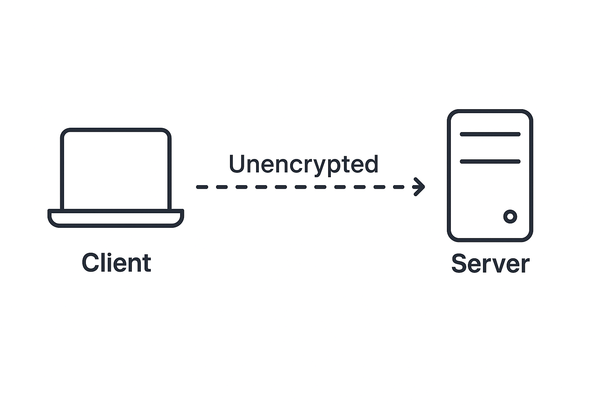
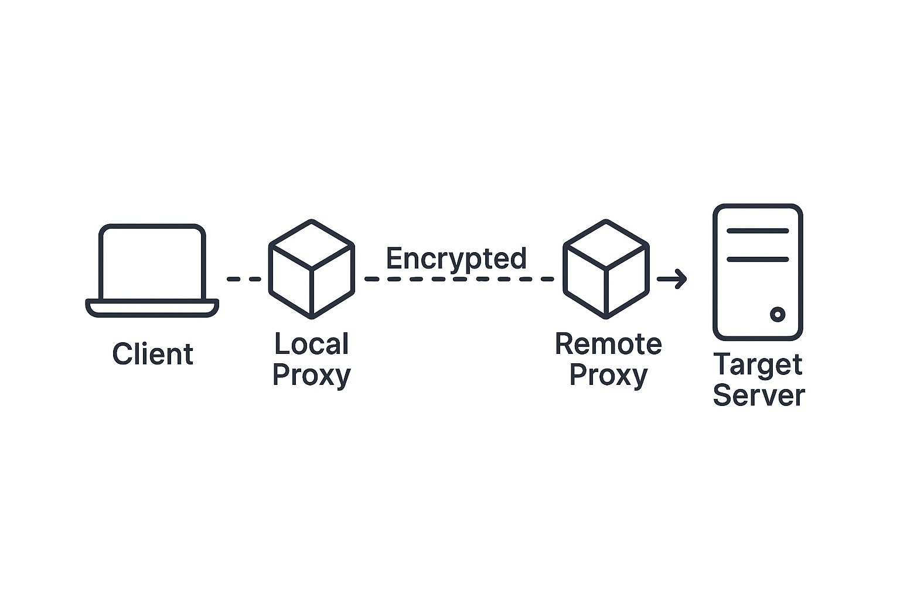
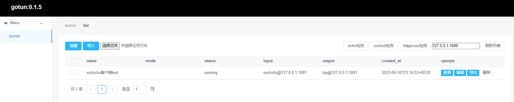

# gotun
tcp/udp转发器，可将明文流量转换为加密流量在公网上传输，如下图所示

明文在公网上传输



加密流量在公网上传输



## Feature
* 支持tcp,udp,quic,kcp,kcpx流量转发
* 支持构建加密安全通道，可使用tcp,udp,quic,kcp,kcpx作通道传输协议
* 支持内网穿透式安全通道
* web界面管理
* 内置echo,http代理,socks5,socks5x服务，可在web界面独立启停
## 使用
点此下载二进制文件，启动即可（会自动生成配置app.yaml）,最简配置:
```yaml
# web监听地址
web_listen: 0.0.0.0:8080
# web登录账号
web_username: admin
# web登录密码
web_password: admin
# 每小时登录失败限制次数
web_login_fail_limit_in_hour: 10
# 日志等级:debug/info/warn/error
log_level: info
# 监控监听地址(pprof与prometheus共用),为空则不开启
metrics_listen: ""
```
访问[127.0.0.1:8080](http://127.0.0.1:8080),输入默认账号密码admin/admin登录,登录后页面：<br>


## 内置服务
为了方便测试和部署，内置了 echo、http 代理、socks5、socks5x 四类服务。
在 web 界面左侧菜单"内置服务"中新建实例即可，支持独立启停、编辑、删除，
配置保存在 `tunnel/` 目录下（每个实例一个 `.service` 文件），改动即时生效、无需重启。

旧版 `app.yaml` 中的 `build-in` 配置已废弃，首次启动会自动迁移为内置服务实例。

## 安全通道服务
### 需求
远程主机有个服务 Server（44.55.66.77:9999），本地 Client 与之通信。<br>
为保证数据安全，在远程主机部署 gotun 作为服务端（stserver，监听端口 B），
本地部署 gotun 作为客户端（stclient，监听端口 A）：<br>
stclient 把流量加密后经公网发往 44.55.66.77:B，stserver 解密后转发给 127.0.0.1:9999。<br>
这样本地 Client 只需访问 localhost:A 即可，公网上传输的全是加密流量，远程也只需开放端口 B。

### 创建
希望通过tcpMux作为加密通道，加密方式为gcm，加密key为goodweather<br>
需要创建一对服务，一个作为客户端，部署在本地：
```json
{
  "name": "stclient",
  "input": "tcp@0.0.0.0:A",
  "output": "tcp_mux@44.55.66.77:B",
  "mode": "",
  "in_proto_cfg": "{\"head\":\"\"}",
  "in_decrypt_mode": "",
  "in_decrypt_key": "",
  "in_extend": "",
  "out_proto_cfg": "{\"head\":\"\"}",
  "out_crypt_mode": "gcm",
  "out_crypt_key": "goodweather",
  "out_extend": "{\"mux_conn\":10}"
}
```
一个作为服务端，部署在44.55.66.77上：
```json
{
  "name": "stserver",
  "input": "tcp_mux@0.0.0.0:B",
  "output": "tcp@127.0.0.1:9999",
  "mode": "",
  "in_proto_cfg": "{\"head\":\"\"}",
  "in_decrypt_mode": "",
  "in_decrypt_key": "",
  "in_extend": "",
  "out_proto_cfg": "{\"head\":\"\"}",
  "out_crypt_mode": "gcm",
  "out_crypt_key": "goodweather",
  "out_extend": ""
}
```
要点：
* 客户端的output需要指向服务端的input，两边的协议、加密方式和加密key需要一致
* 加密通道协议可以是tcp,tcpmux,quic,kcp,kcpmux,kcpx,kcpx_mux

## 更多
* [配置参考](doc/配置参考.md)（app.yaml/tunnel/智能路由/内置服务各字段说明与场景）
* [简单转发服务](doc/简单转发服务.md)
* [内置socks5安全通道](doc/内置socks5安全通道.md)
* [内网穿透式安全通道](doc/内网穿透式安全通道.md)
* [测试](doc/测试.md)
* [其它](doc/其它.md)


